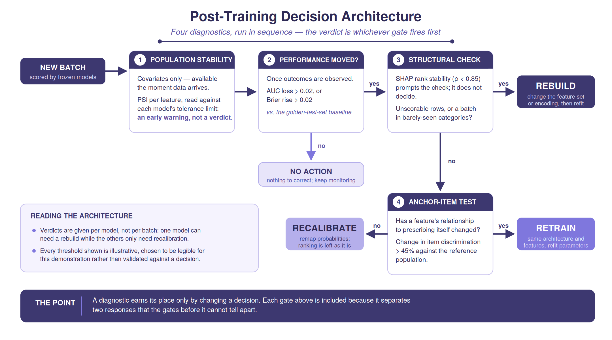

# Medical Rabivy Decision Architecture

**Disclaimer**:

Rabivy and AX Pharmaceuticals are fictional and were created solely for the purposes of this demonstration and portfolio project. This project is an independent demonstration and was not commissioned by any pharmaceutical company.

---

### Introduction

Project 1 built and evaluated three models — Logistic Regression, XGBoost, and an MLP — predicting HCP propensity to prescribe Rabivy, a fictional obesity asset, on a fully synthetic dataset of 5,000 HCPs, evaluated against a held-out golden test set. Project 2 froze those three models exactly as trained and scored them against three simulated state populations (Nebraska, Wisconsin, Mississippi) whose covariate distributions were deliberately shifted while the data-generating process was held fixed. It established that the learned relationships held up under shift, while the predicted probabilities drifted out of calibration as the population diverged from training.

Establishing that degradation exists, and quantifying it, is necessary but incomplete. Diagnostic instruments (e.g., AUC, Brier score, and PSI) are useful in a monitoring harness only if they inform a decision. This third project develops a **decision architecture**: a sequence of diagnostics that separates the three responses available when drift is detected in a new batch.

- **Retrain** — refit the model on new data, keeping the same architecture and feature set. Warranted when a feature's relationship to the outcome has changed.
- **Recalibrate** — remap the predicted probabilities without changing the model's structure. Appropriate when every relationship is intact and only the population's base rate has moved. Because the remapping is monotonic, it restores calibration but cannot recover lost discrimination.
- **Rebuild** — change the feature set or encoding, and refit on that new footing. Warranted when the mapping from inputs to outcome has broken down as a representation rather than as a set of weights.

---

### Core Design Decision: Four Diagnostics, Run in Sequence

1. **PSI, read against a tolerance limit.** Requires only the new batch's covariates, so it is the only check available the moment data arrives. A PSI value says how far a population has moved but not whether that distance matters, so it is paired with a sensitivity analysis that establishes, per model, how much shift each can absorb. Together they are an early warning, not a verdict.
2. **Discrimination and calibration**, once outcomes are observed. Performance counts as having moved when AUC falls by more than 0.02 or the Brier score rises by more than 0.02 against the golden-test-set baseline.
3. **SHAP rank stability and structural checks.** A frozen model's SHAP ranking changes whenever its inputs change, so a drop below ρ = 0.85 prompts a structural check. Can every model score every row, and does a substantial share of the batch fall into categories the training population barely contained? A structural break is the evidence for Rebuild.
4. **Anchor-item invariance.** Reserved for a case still ambiguous after step 3 (i.e., performance has degraded and there is no structural break). Alongside it sits a discrimination floor: an AUC loss beyond 0.05 escalates to Retrain even when no relationship has changed. A breach within 0.005 of that floor is flagged and deferred to judgement. 

**Verdicts are given per model, not per batch** — one model can need a rebuild while the others only need recalibration. 

**Every threshold is illustrative**, chosen to separate the batches this project actually contains for demonstration purposes, rather than validated against a downstream commercial decision. 

---
